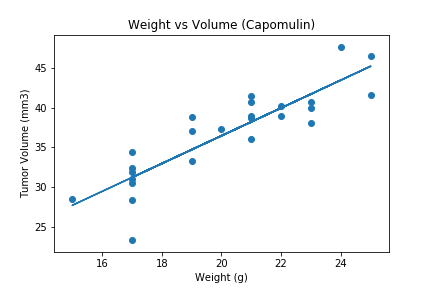

# Matplotlib-Cancer_Pharmaceutical_Testing_Analysis_Visualizations
This [Pharmaceutical_Analysis](Pharmaceutical_Analysis.ipynb) script examines data from an animal study. In this study, 249 mice identified with SCC tumor growth and were treated through a variety of drug regimens. Over the course of 45 days, tumor development was observed and measured. The purpose of this study was to compare the performance of the drug, Capomulin, versus the other treatment regimens. 

This script:
* Removes any duplicated time points for each mouse ID
* Generates a summary statistics table consisting of the mean, median, variance, standard deviation, and SEM of the tumor volume for each drug regimen.
* Generates a bar plot that shows the number of total mice for each treatment regimen throughout the course of the study, using both Pandas & Matplotlib

* Calculates the final tumor volume of each mouse across four of the most promising treatment regimens: Capomulin, Ramicane, Infubinol, and Ceftamin. 
* Calculates the Quartiles and IQR and quantitatively determine if there are any potential outliers across all four treatment regimens.
* Generates a box and whisker plot of the final tumor volume for all four treatment regimens and highlights any potential outliers in the plot.

* Selects a mouse that was treated with Capomulin and generate a line plot of time point versus tumor volume for that mouse.

* Generates a scatter plot of mouse weight versus average tumor volume for the Capomulin treatment regimen.

* Calculates the correlation coefficient and linear regression model between mouse weight and average tumor volume for the Capomulin treatment and plots the linear regression model on top of the previous scatter plot.
* 
- - -
### Tech Stack
* Python
### User Instructions
* Clone the repository: git clone https://github.com/DarrylB32/Matplotlib-Cancer_Pharmaceutical_Testing_Analysis_Visualizations
* Open and execute [Pharmaceutical_Analysis](Pharmaceutical_Analysis.ipynb) file.
 
### Additional Notes
Images of all graphs have been saved to the [output_data](output_data) folder.